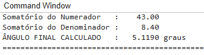

# Sistema de Inferência Fuzzy para Desvio de Obstáculos em Robótica Móvel

Este repositório contém a implementação computacional de um controlador fuzzy reativo projetado para navegação de robôs móveis. O sistema processa as leituras de sensores de distância e decide dinamicamente o ajuste de direção necessário para evitar colisões com obstáculos, produzindo transições suaves de comportamento.

## Variáveis do Sistema

**Entradas:**
* **Distância frontal ao obstáculo (d):** Universo d ∈ [0, 100] cm.
* **Termos linguísticos:** {Perto, Média, Longe}

  
* **Assimetria lateral (a = d_dir - d_esq):** Universo a ∈ [-50, 50] cm.
* **Termos linguísticos:** {Negativa, Zero, Positiva}

**Saída:**
* **Ângulo de direção (θ):** Universo θ ∈ [-45°, 45°].
* **Termos linguísticos:** {Virar Esquerda, Seguir em Frente, Virar Direita}

## Base de Regras Fuzzy

A matriz de inferência segue o padrão cruzado entre a distância frontal e a assimetria lateral, utilizando o operador Mínimo para o conectivo **E** e a implicação de Mamdani.

| Frontal \ Assimetria | Negativa | Zero | Positiva |
| :--- | :--- | :--- | :--- |
| **Perto** | Virar Esquerda | Virar Direita | Virar Direita |
| **Média** | Virar Esquerda | Seguir em Frente | Virar Direita |
| **Longe** | Seguir em Frente | Seguir em Frente | Seguir em Frente |

## Instruções de Execução

A implementação computacional foi desenvolvida utilizando sintaxe algébrica nativa e executada em Windows 10:

1. Abra o arquivo `fuzzy_robotica.m` no **MATLAB**, **MATLAB Online** ou **GNU Octave**.
2. Execute o script.
3. O terminal exibirá o resultado obtido.
4. Uma janela gráfica plotará a região final do Centro de Área (CDA).

## Resultado da Simulação

Para o cenário de teste exigido pela atividade, o sistema ativou a matriz de regras e defuzzificou a saída agregada com o seguinte resultado:

* **Ângulo de Direção Calculado:** 5.1190 graus (ajuste corretivo suave à direita).

## Cálculos Manuais

Os cálculos manuais das 5 fases também foram executados, e todo o processo encontra-se a seguir: 

📄 [Acessar o documento com o cálculo manual das 5 fases (PDF)](calculos_manuais.pdf)

Por fim, conclui-se que o resultado calculado e simulado são extremamente próximos, o que válida a atividade. 

## Autora
---
**Nome:** Rebeca Natielle Rego Santos
**Matrícula:** 202211130010  
**Disciplina:** Automação Inteligente  
